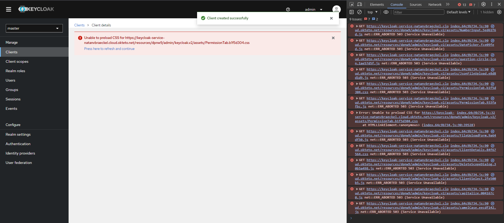
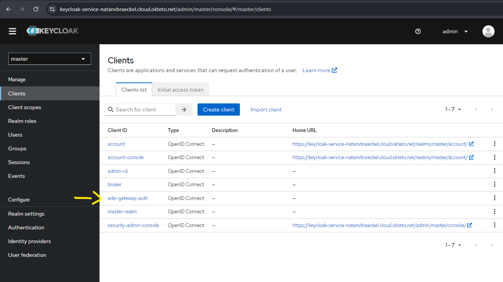
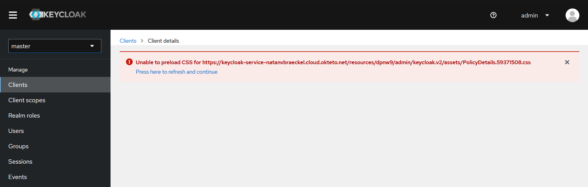

# EDE-Project

## De problemen die ik gekregen heb bij het uitproberen van keycloak (op okteto)
Ik kreeg vaak dezelfde errors, dat bepaalde css of js files niet konden opgehaald worden.\
Door de pagina een aantal keer te herladen kon je geluk hebben en dus aan de volgende stap beginnen.
### Client page

### Eens de client gemaakt is (voorbeeld van een error)

### Client wel degelijk gemaakt (na aantal keer herladen)
De client is nu wel aangemaakt, maar de home en root url moet nog wel gezet worden op de url van de gateway.\

### Naar de details page van de client gaan is nooit gelukt, dus ik heb dan keycloak opgegeven

Versie 20.0.0 is het verste dat ik ben geraakt, want bij verdere versies was een https certificaat nodig vanwege okteto die automatish https gebruikt.\
Daar heb ik niet mee verder gewerkt, omdat ik onzeker was of ik daarna ook wel degelijk verder kon geraken dan ik tot nu to was geraakt.